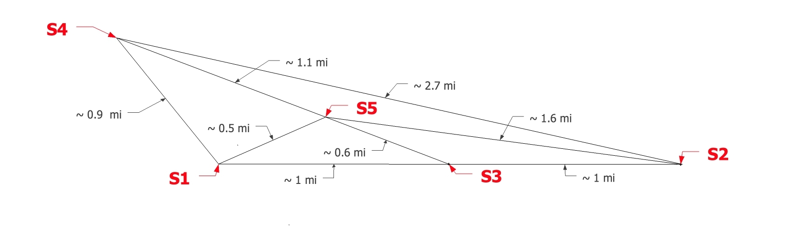
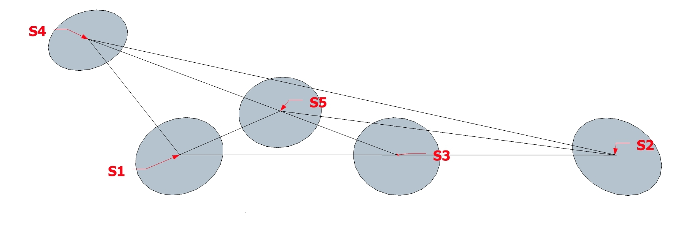
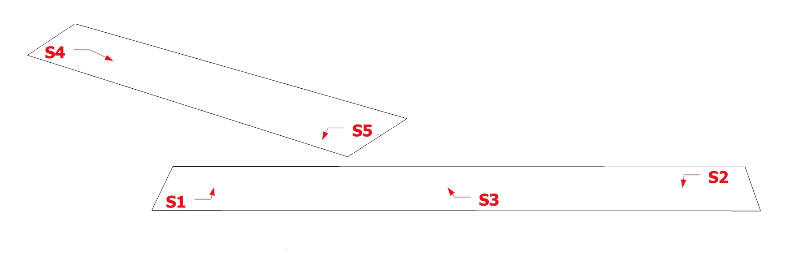

** A running version can be found at **
https://martingascon.shinyapps.io/Supermarket/
 
# 1. Introduction

There is a large dataset containing geographical information about points of sale for products, for thousands of customers 
 and thousands of products. The original dataset was in the form of 3 tables:
a)  supermarket_distances: three columns. The first column is the customer id, the second is the shop id and the third 
is the distance between the customer’s house and the shop location. The distance is a calculated in meters as a straight 
line so it does not take into account the road graph.
b) supermarket_prices: two columns. The first column is the product id and the second column is its unit price. 
The price is in Euro and it is calculated as the average unit price for the time span of the dataset.
c) supermarket_purchases: four columns. The first column is the customer id, the second is the product id, the third 
is the shop id and the fourth is the total amount of items that the customer bought the product in that particular shop. 
The data is recorded from January 2007 to December 2011.

## 1.1 Motivation and Goals

For ease of analysis, we will be working with an aggregated version of the dataset.  
The data is aggregated by customer, and info from different shops are pivoted to new columns. 
We've added this file (csv format) to the "Data Challenges/Supermarket" Dropbox folder.

Imagine you were a data scientist working for a large supermarket chain and were given this dataset. 
Obviously you will need to initially explore and visualize the data, but ultimately try to find *actionable*
insights rather than "interesting" findings.
 
---

# 2. Analysis

## 2.1 Exploratory analysis

The exploratory analysis using R language reveals that we have around 60 thousand customers and 40 variables which correspond to distances, number of products purchased, number of unique products purchases, amount purchased, average price. The data also includes a column with the number of shops used by customers.

#### Information from general averages:

_Taking the average for every column of the data we can respond the following questions:_

1. What is the most expensive/cheapest supermarket?
2. What is the closest/farthest supermarket in average for all the costumers?
3. What is the difference in amount purchased between supermarkets?
4. What is the difference in number of products purchased between supermarkets?


```{r, echo=FALSE}
# read the file
data = read.table("./supermarket_data_aggr.csv", sep=",",head=TRUE)   
#labels for X
super = c("S1","S2","S3","S4","S5")

inputPanel(
  selectInput("var", label = "Select average of:",
              choices = c("Average price", "Average distance", "Average amount purchased", "Average number of products purchased"), selected = "Average price")
)

renderPlot({
  par(mfrow = c(1, 1))
  par(mar=c(5,4,4,2)) 
  
  # calculate the mean prices, distances, number of products, amounts, etc.  
  price = c(summary(data$avg_price_shop_1)[4],summary(data$avg_price_shop_2)[4],summary(data$avg_price_shop_3)[4],
            summary(data$avg_price_shop_4)[4],summary(data$avg_price_shop_5)[4])
  names(price) = super
  
  ave_dist = c(summary(data$distance_shop_1)[4],summary(data$distance_shop_2)[4],summary(data$distance_shop_3)[4],
               summary(data$distance_shop_4)[4],summary(data$distance_shop_5)[4])
  ave_dist = ave_dist/1000*1.6
  names(ave_dist) = super
  
  ave_amou_purch = c(summary(data$amount_purchased_shop_1)[4],summary(data$amount_purchased_shop_2)[4],
                     summary(data$amount_purchased_shop_3)[4],summary(data$amount_purchased_shop_4)[4],
                     summary(data$amount_purchased_shop_5)[4])
  ave_amou_purch
  names(ave_amou_purch) = super
  
  ave_prod_purch = c(summary(data$products_purchased_shop_1)[4],summary(data$products_purchased_shop_2)[4],
                     summary(data$products_purchased_shop_3)[4],summary(data$products_purchased_shop_4)[4],
                     summary(data$products_purchased_shop_5)[4])
  ave_prod_purch
  names(ave_prod_purch) = super
  
  d <- list("price", "ave_dist", "ave_amou_purch", "ave_prod_purch")
  names(d) =c("Average price","Average distance","Average amount purchased",
              "Average number of products purchased")

  var2 <-d[input$var]
  gr <- eval(parse(text=var2))
  title = input$var
  ylabel = input$var
  barplot(gr, main=title, xlab="Supermarket", ylab = title,col="red" )
})
```

##### Conclusions: 

1. S1 is the most expensive supermarket.
2. S3 is the closest to all the neighborhs, so it is probably in the middle.
3. Even though S1 is the most expensive supermarket, the amount purchased in S1 is the highest.
4. The number of products purchased in S1 is higher but not that much higher than S2 when compared 
with the amount purchased because higher prices of S1. 

---

### 2.2 Data Processing/Results

#### 2.2.1 Supermarket location


**What is the relative position between supermarkets?**

In order to find the relative position between supermarkets, I have to following assumptions:

_Assumptions:_

1. I can estimate the real distance between supermarkets using the distance of customers that are neighbohrs to one specific supermarket (e.g. closest 1000 customers).
2. If one asumes that neighbohrs are ramdonly distributed around a supermarket, the mean of the
distance to the next supermarket should be close to the real distance between those two supermarkets. 
3. Using the five supermarkets, I can make a matrix of distances between supermarkets. 
4. Fixing the position of 1 supermarket and doing triangulation I can guess the position for the rest of the
supermarkets. 

_Results_

As example, you can run an histogram with the distance **from** one supermarket **to** another using the closest customers to the first supermarket (determined by the slider 'Nb of neighbohrs').

```{r, echo=FALSE}

# order by distance to each supermarket
dist_s1 <- data[order(data$distance_shop_1),]
dist_s2 <- data[order(data$distance_shop_2),]
dist_s3 <- data[order(data$distance_shop_3),]
dist_s4 <- data[order(data$distance_shop_4),]
dist_s5 <- data[order(data$distance_shop_5),]

inputPanel(
  selectInput("var_s", label = "Select supermarket 1", choices = c("S1","S2","S3","S4","S5"), selected = "S1"),
  selectInput("var_t", label = "Select supermarket 2", choices = c("S1","S2","S3","S4","S5"), selected = "S2"),
  sliderInput("nbreaks", label = "Nb of bins:", min = 10, max = 100, value = 100, step = 1),
  sliderInput("neigh", label = "Nb of neighbohrs around supermarket 1 :", min = 10, max = 1000, value = 500, step = 10)
  )

renderPlot({
  d1 <- list("dist_s1", "dist_s2", "dist_s3", "dist_s4","dist_s5")
  names(d1) =c("S1","S2","S3","S4","S5")
  d2 <- list("distance_shop_1","distance_shop_2", "distance_shop_3", "distance_shop_4","distance_shop_5")
  names(d2) =c("S1","S2","S3","S4","S5")
 
  var_ss <-d1[input$var_s]  
  var_tt <-d2[input$var_t] 
  
  sdata <-(eval(parse(text=var_ss))[[as.character(var_tt)]])
  sdata <- sdata[1:input$neigh]
  
  par(mfrow = c(1, 1))
  par(mar=c(5,4,4,2)) 
  text = paste("Distance from ",input$var_s," to ",input$var_t)
  hist(sdata/1600,breaks=input$nbreaks, main=text,xlab = "Distance in mi")
  abline(v=mean(sdata)/1600, col="red",lwd=2)
  
})
 
 
#mtext(round(mean(dist_s1$distance_shop_2[1:1000])/1600,1), side=1, line=-16, at=2.1, col="red") 
#mtext("mean =", side=1, line=-16, at=2, col="red") 

```

Calculations for every pair of supermarkets allows to obtain the matrix of relative distances between supermarkets:

```{r, echo=FALSE}

par(mfrow = c(1, 1))
par(mar=c(5.1,4.1,4.1,2.1))
#mean(dist_s5$distance_shop_1[1:1000])
#hist(dist_s5$distance_shop_1[1:1000],breaks=5)

# distribution of price vs distance. I need to calculate distance btw supermarkets
dist_matrix = matrix(nrow=5,ncol=5)
for(i in 1:5)
  {
  for(j in 1:5)
    {
    sup = paste("dist_s",as.character(i),"$distance_shop_",as.character(j),"[1:1000]",sep="")
    dist_matrix[i,j]=round(mean(eval(parse(text = sup))),0)  
    if (i==j) dist_matrix[i,j]=0
    }
  }

M<-round(dist_matrix[1:5,1:5]/1600,1)
colnames(M) = super
rownames(M) = super
M
#corrplot(M, method = "number",cl.lim=c(0,1))
```

Diagonal elements show differences in distance (up to 0.2 miles in case of S1) becuase of the low density of customers around S1, as can be seen in 2.2.4. Let's take the average of diagonal elements to reduce the error and put the values on the upper part of the matrix. 

```{r, echo=FALSE}
dist_matrix_ave= matrix(nrow=5,ncol=5)
for(i in 1:5)
{
  for(j in 1:5)
  {
    dist_matrix_ave[i,j]=round(((dist_matrix[i,j]+dist_matrix[j,i])*0.5)/1600,1)
    if (i>j) dist_matrix_ave[i,j]=0
  }
}
M2<-round(dist_matrix_ave[1:5,1:5],1)
colnames(M2) = super
rownames(M2) = super
M2
```

Using this information, I can finally put S1 in the origin (0,0) and find the actuall position of the rest of the supermarkets by triangulation. 



##### Conclusions: 

1. Supermarkets S1, S2 and S3 are aligned and 1 mile away from each other, so they are probably in the same avenue of the city. 
2. S4 is the farthest one, and S3 is the closest to all customer as predicted in previous plots. 
 
---
##### 2.2.2 Number of shops used by customers
 
```{r, echo=FALSE}
# number of supers visited per user
users = nrow(data)
par(mfrow = c(1, 1))
par(mar=c(5.1,4.1,4.1,2.1))

h=hist(data$shops_used,breaks=5,plot = FALSE)
h$density = h$counts/users*100
plot(h,freq=FALSE,  xlab="number of supermarkets", ylab="% of users", main="Histogram of shops used", col="blue", xlim=c(1,5.5),xaxt="n" )
axis(1, at=seq(1.5, 5.5, by=1), labels=c( "1", "2", "3", "4", "5") )
abline(v=summary(data$shops_used)[4]+0.5, col="red",lwd=2)
mtext(summary(data$shops_used)[4], side=1, line=-10, at=3.6, col="red") 
mtext("mean =", side=1, line=-10, at=3.2, col="red") 
```

##### Conclusions: 

1. Most of the users (60%) go to just one supermarket.
2. 26% of users visit 2 supermarkets.
3. 11 % goes to 3 supermarkets and only 3% visit 4 supermarkets.
4. In average users visit 2.38 supermarkets.
 
---

##### 2.2.3 Distance traveled by customers (purchasing in a single supermarket)

I want to know how much are customer willing to travel to an specific supermarket.
As the simplest model, let's consider only those customers visiting only one supermarket. 

```{r, echo=FALSE}

# those visiting only one supermarket 
s1_only = subset(data,products_purchased_shop_1>0 & shops_used==1)
s2_only = subset(data,products_purchased_shop_2>0 & shops_used==1)
s3_only = subset(data,products_purchased_shop_3>0 & shops_used==1)
s4_only = subset(data,products_purchased_shop_4>0 & shops_used==1)
s5_only = subset(data,products_purchased_shop_5>0 & shops_used==1)

s1o <- s1_only$distance_shop_1
s2o <- s2_only$distance_shop_2
s3o <- s3_only$distance_shop_3
s4o <- s4_only$distance_shop_4
s5o <- s5_only$distance_shop_5

inputPanel(
  selectInput("var3", label = "Select supermarket:", choices = c("S1","S2","S3","S4","S5"), selected = "S1"),
  sliderInput("n_breaks", label = "Nb breaks:", min = 10, max = 100, value = 50, step = 5)
  )

renderPlot({
  par(mfrow = c(1, 1))
  par(mar=c(5,4,4,2)) 
  d <- list("s1o", "s2o", "s3o", "s4o","s5o")
  names(d) =c("S1","S2","S3","S4","S5")
  var4 <-d[input$var3]
  gr <- eval(parse(text=var4))
  h1 = hist(gr/1000/1.6,breaks=input$n_breaks, main=input$var3,xlab = "Distance in mi")
})


#par(mfrow = c(3, 2))
#par(mar=c(5.1,4.1,4.1,2.1))
#h1 = hist(s1_only$distance_shop_1/1000/1.6,breaks=100, main="S1 customers",xlab = "Distance in mi")
#h2 = hist(s2_only$distance_shop_2/1000/1.6,breaks=100, main="S2 customers",xlab = "Distance in mi")
#h3 = hist(s3_only$distance_shop_3/1000/1.6,breaks=100, main="S3 customers",xlab = "Distance in mi")
#h4 = hist(s4_only$distance_shop_4/1000/1.6,breaks=100, main="S4 customers",xlab = "Distance in mi")
#h5 = hist(s5_only$distance_shop_5/1000/1.6,breaks=100, main="S5 customers",xlab = "Distance in mi") 
```

##### Conclusions: 

1. It seems that people come to S1 from two other locations at 3 and 4 miles away.
2. For S2 people travel up to 3 miles and a few of them up to 5 miles.
3. For S3 customers travel from 0.5 to 1 mile.
4. For S4 and S5, most of the people only travel 0.5 miles.

---

##### 2.2.4 Percentage of customers purchasing in >1 supermarket

Let's select those customers buying in more than one shop. On the vertical axis (S1-S5) we have the reference supermarket and the horizontal the destination. 


```{r, echo=FALSE}
library(corrplot)
s1_another = subset(data,products_purchased_shop_1>0 & shops_used>1)
s2_another = subset(data,products_purchased_shop_2>0 & shops_used>1)
s3_another = subset(data,products_purchased_shop_3>0 & shops_used>1)
s4_another = subset(data,products_purchased_shop_4>0 & shops_used>1)
s5_another = subset(data,products_purchased_shop_5>0 & shops_used>1)

sup_corrs = matrix(nrow=5,ncol=5)
for(i in 1:5)
{
  aux =paste("products_purchased_shop_",as.character(i),sep="") 
  subtable = subset(data,eval(parse(text = aux))>0)
  total<- dim(subtable)[1]
  for(j in 1:5)
  {
    aux2 = paste("s",as.character(i),"_another$amount_purchased_shop_",as.character(i),sep="")
    aux3 = paste("s",as.character(i),"_another$amount_purchased_shop_",as.character(j),sep="")
    sup_corrs[i,j] =  round(table(eval(parse(text = aux2))>0 & eval(parse(text = aux3))>0)[2]/total*100,1)
    if (i==j)  sup_corrs[i,j]=100
  }
}
#sup_corrs
M<-sup_corrs[1:5,1:5]/100 
colnames(M) = super
rownames(M) = super
corrplot(M, method = "number",cl.lim=c(0,1))
```

##### Conclusions: 

1. It is remarkable that 92% of customers who buy in S2 also buy in S1. Additionally 74% of S1 customers also buy in S2.
2. It is also curious that 83-94% of S3 customers buy in S2/S1 while only 35-38% of S1/S2 customers buy in S3.
3. Customers from S4 and S5 go to S1 and S2 but opposite does not happen. 

---

##### 2.2.5 Customer density around supermarket

The density of customers around the supermarket will provide information about the population density. 



In this plot we can select the radius to calculate the customer density around each Supermarket. If the radius is too small the density has big errors but if the radius is too large we are counting customers around other supermarkets. 


```{r, echo=FALSE}


inputPanel(
  sliderInput("dtsm", label = "Distance to supermarket", min = 0, max = 5, value = 0.4, step = 0.1)
  )

renderPlot({
  
  
  rad = input$dtsm # in miles
  rad = rad*1.6 # to km
  area = 3.141592654*rad^2 # in km2 
  d1 <-dim(subset(data,distance_shop_1<rad*1000))[1]/area
  d2 <-dim(subset(data,distance_shop_2<rad*1000))[1]/area
  d3 <-dim(subset(data,distance_shop_3<rad*1000))[1]/area
  d4 <-dim(subset(data,distance_shop_4<rad*1000))[1]/area
  d5 <-dim(subset(data,distance_shop_5<rad*1000))[1]/area
  
  
  par(mfrow = c(1, 1))
  par(mar=c(5,4,4,2)) 
  
  density_at_300m = c(d1,d2,d3,d4,d5)
  barplot(density_at_300m, xlab= "Supermarket", ylab= "Customer density (customers/km^2)", col="red") 
  })

```

##### Conclusions: 

1. We can observe that the density around S1 is very low which most likely mean we are in a residencial area. 
2. S2 and S3 have high density which means we are in most likely in neighbohrhoods with lots of buildings and/or businesses (downtown areas) 
3. S4 and S5 have densities in between. 



Most likely Areas 4-5 are somehow disconnected form the line S1-S3-S2. 

---

### 3. General conclusions

Considering all the previous results, we can extract some general conclusions. 

1. S1 is located on a residencial area with low density (expensive homes) and that's why S1 is probably the most expensive supermarket. 
2. S2/S3 are in an area with high density (cheaper than S1) most likely downtown where people work and do groceries after that. 
3. S4-S5 are in neighbohrhoods more disconnected from the corridor S1-S3-S2 and that is why people from this side don't go for groceries to that neigbohrhood. S4-S5 have less density which may mean they are in a poorer area compare with areas of high/low density and that is why supermarkets in these areas are cheaper compared to S1-S3-S2. 

---


